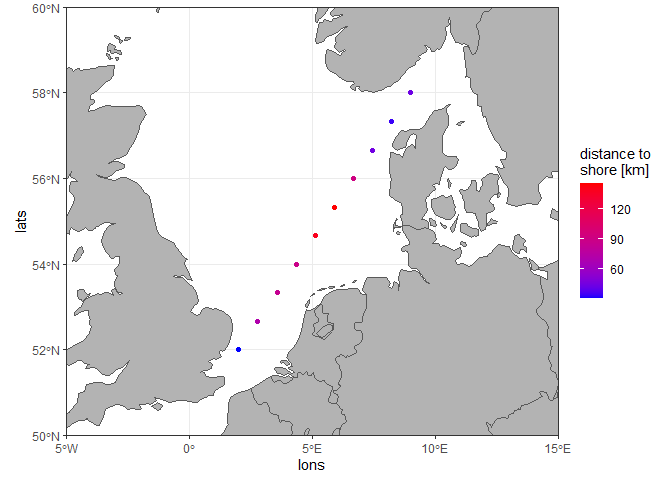

Distance to coastline
================

## Description

This function is a wrapper for a few other functions and calculates the
distance of geo points to the nearest coastline. It is meant to be used
for marine data. In fact it calculates the distance to the nearest line.
When using the `coastline = "mapdata"` method, for points on land the
result may well be the distance to a national border that is not the
coastline! The method `coastline = "ne"` uses lines representing only
the coastline, but with much lower resolution.

The input (and the coastline) will be regarded as WGS84. This can be
reprojected to the planar UTM 32 references system by choosing
`as_UTM32 = TRUE`, which will make the processing faster, especially
when global coastline is not filtered via `coastline_crop`, but it is
only recommended for smaller spatial extend, or for a quick overview.

EDIT: After updates to the sf package, “[the earth is no longer
flat](https://r-spatial.org/r/2020/06/17/s2.html)”. This creates
problems with the use of `coastline = "mapdata"`. As a workaround use
`spherical = FALSE` to turn off S2 processing.

The result is either a vector of distances (in m) corresponding to the
input coordinates (default) or a matrix of distances between each point
and each line of the coastline data (this may actually be quite useless
because the coastline data is not output). A figure of the results can
be plotted with the `plot = TRUE` argument.

NOTE: requires packages `mapdata` (for `coastline = "mapdata"`) and
`rnaturalearthdata` (for `coastline = "ne"`) to be installed.

## Arguments

*lons* – vector of longitudes

*lats* – vector of latitudes

*coastline_crop = NULL* – numeric vector with xmin, ymin, xmax and ymax
for cropping the coastline to a bounding box, e.g. c(xmin = -1, ymin =
50, xmax = 11, ymax = 60), elements do not have to be named but must be
in the correct order

*coastline = “ne”* – coastline source; “ne” for Natural Earth
(www.naturalearthdata.com) (faster), “mapdata” for using `map('world')`
(more precise)

*as_utm32 = FALSE* – transform both points and coast to UTM32, i.e. a
planar projection, for more speed

*spherical = FALSE* – the default turns off S2 processing in the sf
package, the previous system state is saved and restored when the
function is run.

*output = “mindist”* – “mindist” for distance to nearest coastline,
“distmat” for matrix of distances between points (in rows) and every
line (in cols)

*plot = FALSE* – should the result be shown in a plot

## Value

When `output = "mindist"` a vector of distances in m to the nearest
coastline corresponding to the input points.

When `output = "distmat"` a matrix of distances in m with the rows
corresponding to input points and columns corresponding to each line
element of the coastline data.

When `plot = TRUE` a plot will be output in the graphic device.

## Examples

Dummy points:

``` r
lons <- seq(2, 9, length.out = 10)
lats <- seq(52, 58, length.out = 10)
```

Default result

``` r
dist <- dist2coast(lons, lats)
dist
```

    ##  [1]  32170.82  74544.29  81416.67 100955.32 143297.58 142759.84  89782.11
    ##  [8]  42071.88  31545.26  50412.19

Result with finer coastline, filtered coastline, and plot output

``` r
dist <- dist2coast(lons, lats, coastline_crop = c(-5, 50, 15, 60), coastline = "mapdata", plot = TRUE)
```

<!-- -->

``` r
dist
```

    ##  [1]  31031.58  70734.84  83577.18  88236.61 138237.26 144945.10  91933.34
    ##  [8]  44650.78  34420.04  43762.62
